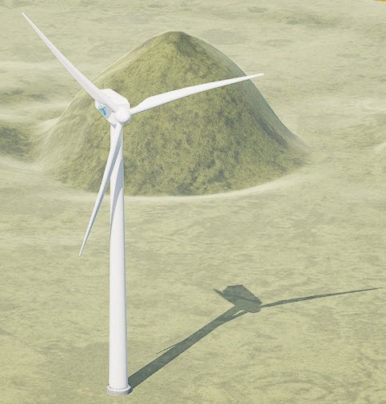

# ADT3Dimension
Azure Digital Twin and the 3rd dimension - step by step

 

This repo will define a simple example of a windturbine, consists in its base form of five parts (foundation, tower, generator, nacelle, rotorblade) based on [Azure Digital Twin Services](https://docs.microsoft.com/en-us/azure/digital-twins/). The ultimate goal is to have a 4K animation of the windturbine with real live data.  

**First Step** is to setup an ADT environment to create a basic fundament to work with.
I think for the beginning it is best to do the first steps with the ADT Explorer and replace the files to upload with the ones in the files section:
https://docs.microsoft.com/de-de/azure/digital-twins/quickstart-azure-digital-twins-explorer .
For my example you can find some [files & explanation](files/) here.

A detailled explanation and some screen about the results can be found [here](firststepinexplorer/README.md):

**2nd Step**: Set the connection from external data sources via API call and let the ADT Instance consume live data [here](connectiontoADT/) 

**3rd Step**: Start with the 3rd dimension in various ways: [Info here](3rdDimension/)  

**Finally** a few useful ressources: 
https://github.com/MicrosoftDocs/azure-docs/tree/main/articles/digital-twins

