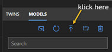
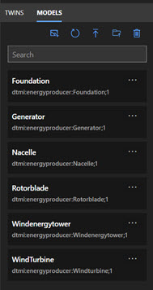
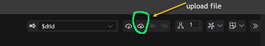
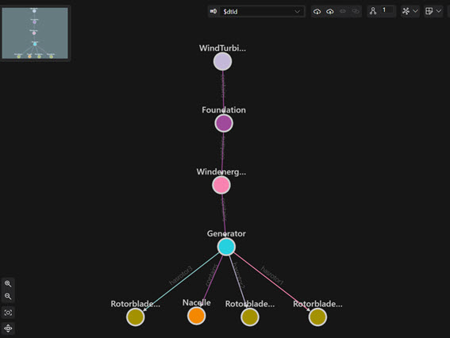
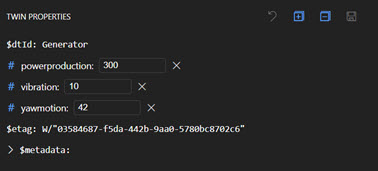

# Create the windturbine in ADT Explorer

First go through the setup for the service as described here:
https://docs.microsoft.com/de-de/azure/digital-twins/quickstart-azure-digital-twins-explorer 

Stop if you can see the window of the explorer. Than add the *.json files from the files-directory as nodes to the UI. 

 
If you have successfully uploaded all the files your explorer should show all these nodes:  

 
And than we need to upload the *.xlsx file to define the graph and use some initial data to populate the nodes. 

 
After the success message **do not forget to save**, because only after that the graph is in the system. The screen should look like this: 

 
And you can also see some intitial values from the *.xlsx file, if you klick on one node:
 

 
Now query: 

<strong>"SELECT * FROM digitaltwins T where T.powerproduction > 250"</strong>
  
And the result should be: <strong>the node Generator</strong>

<a href="https://github.com/DittmannAxel/ADT3Dimension">-back-</a>

